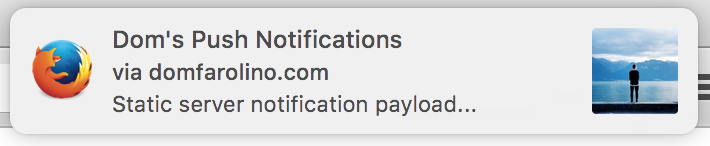

# push-notifications

[](http://opensource.org/licenses/MIT)
[](https://david-dm.org/domfarolino/push-notifications)
[](https://david-dm.org/domfarolino/push-notifications#info=devDependencies)

This app demonstrates the [web-push-libs/web-push](https://github.com/web-push-libs/web-push) NodeJS library which facilitates sending web push notifications with encrypted payloads via a custom backend.

# Demo
Demo the live application [here](https://domfarolino.com/push-notifications)

# Getting started

Running the client side app:

```sh
git clone git@github.com:domfarolino/push-notifications.git
cp .env.example .env # copy environment variable structure
npm install
npm run dev # run the client locally
```

To run the *server* locally you must export the necessary environment variables. Environment variables should appear in the `.env` file, and below is an explanation of what each variables is used for:

 - `PORT`: Defines the port on which the server will run.
 - `FIREBASE_API_KEY`: The server uses Firebase cloud messaging to send push notifications. To use the service you need an API key associated with your application. To register an application with Firebase go to the [Firebase console](https://console.firebase.google.com/).
 - `MONGO_URL`: Push notification credentials generated by the client are persisted in MongoDB. Use your mongo URL to save client-generated credentials.
 - `API_KEY`: Used to secure some routes local to this application, such as `/credentials`.

You can now run the server:

 - Run `npm start`
 - If you're running a local client too, make sure the client code points to your local server instead of your production server. In `src/js/main.js` change any occurrences of the remote API (`https://push-notifications-sw.herokuapp.com`) to `http://localhost:5000` and unregister old service workers.

If you have write access, deploying the app can be done in two parts:

Client deployment: `npm run deploy`

Server deployment: Login to Heroku, ensure all necessary environment variables are exported, and deploy from the master branch of this repository.

# Push Notification Screenshots

## Chrome


## Firefox


